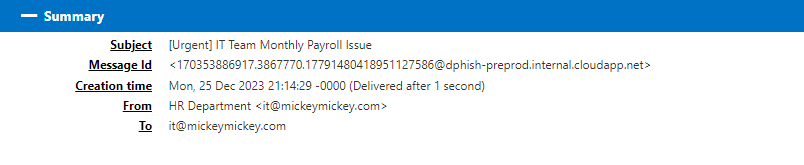
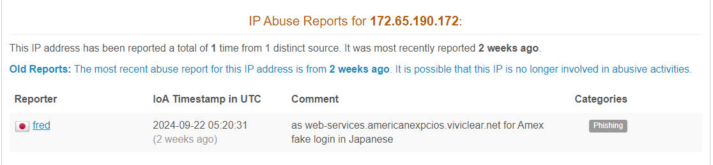
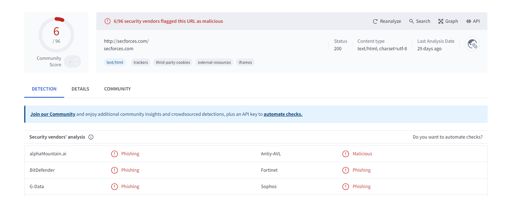
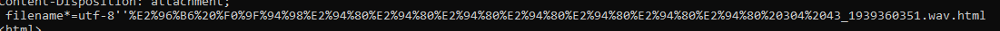
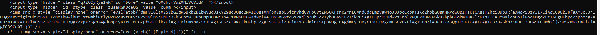

## Phishing mail analysis 


_EML File_


## Summary

_summary_
The email pretends to be from a legitimate source and includes an attachment that, at first glance, appears to be a harmless file (in this case, disguised as a `.wav` file). However, upon closer inspection, it is clear that the attachment is actually an `.html` file containing hidden scripts that can execute malicious code once opened in a browser.


## Technical analysis
### 1-legitimate traffic:

_mail header_
 attackers often take advantage of legitimate email processing systems to make their phishing attempts seem more authentic. For instance, when they use the loopback address `127.0.0.1`, it can make it look like the email is coming from within the organization itself. Plus, by employing `DKIM` signatures, they can further legitimize their emails. This clever tactic can really help them slip past security controls, especially if the system isn’t properly configured. It makes detecting these phishing emails much more challenging.

### 2-Mail Connection:

_abuseipdb_
report details from `AbuseIPDB`:The analysis of `http://secforces.com/` involved a fake login page for American Express, indicating the intent was to harvest user credentials.


_virusTotal_
report details from `virusTotal`: The analysis of `http://secforces.com/` indicates that it is associated with malicious activity, particularly phishing. 

### 3-Malicious Attachment 

_obfuscate_
The file is named with a `.wav.html` extension, which is designed to confuse the recipient into thinking it's an audio file, but it's actually an HTML file. This is a common trick used to bypass email security filters by disguising the file type.

### 4-Payload

_payload_
The attached `.html` file contains obfuscated ```JavaScript``` within HTML tags. This script is designed to run automatically when the file is opened.


## how to detect??

1. Mail Gateway Security
2. Endpoint Protection
3. Threat Intelligence Integration
4. Implement Advanced Email Filtering
5. Implement a Security Information and Event Management (SIEM)
6. Monitor for Indicators of Compromise (IoCs).

By employing a combination of technical controls, user education, and proactive threat monitoring

<meta name="description" content="{{ page.description }}">

## References
- https://attack.mitre.org/techniques/T1598/002/
- https://www.cloudflare.com/learning/email-security/dmarc-dkim-spf/
- https://www.mimecast.com/content/dkim/
