<style>
  img {
    border: 1px solid #ddd;
    border-radius: 8px;
    height: auto;
    transition: transform 0.2s ease-in-out, box-shadow 0.2s ease-in-out;
  }
  img:hover {
    transform: scale(1.05);
    box-shadow: 0 4px 8px rgba(0,0,0,0.2);
  }
</style>

### Toolkit

This lab uses a standard set of tools for advanced static analysis.

| Tool | Type | Purpose | Typical Usage & Notes |
| :--- | :--- | :--- | :--- |
| **PE Studio** | Static | Get a high-level overview of PE headers, imports, and strings. | Excellent for a quick first look to spot suspicious indicators and check for packers. |
| **Detect It Easy**| Static | Identify packers, compilers, and file formats. | Use this early to determine if the sample is obfuscated before diving into disassembly. |
| **Strings** | Static | Extract all printable strings from the binary. | Run `strings -a sample.dll` to find potential IOCs like URLs, file paths, or commands. |
| **IDA Pro / Ghidra**| Static | Disassemble and decompile code for in-depth analysis. | Essential for mapping control flow, understanding function logic, and finding the core malware behavior. |
| **x64dbg** | Dynamic | Debug the malware by stepping through its execution. | Used to observe runtime behavior, inspect memory, and confirm hypotheses from static analysis. |

---

## Lab 5-1

### 📝 Summary

Chapter 5 shifts our focus to **DLL (Dynamic Link Library) malware**. Unlike standalone executables, DLLs are loaded into the address space of other processes, making them a powerful tool for achieving stealth and persistence. Attackers frequently use malicious DLLs for techniques like **DLL injection**, **API hooking**, and creating modular malware.

This lab applies advanced static analysis to `Lab05-01.dll` to determine its functionality without running the code.

---

### 📍 Question 1: DllMain

> **What is the address of DllMain?**
{: .prompt-tip }

The `DllMain` function is located at the address **`0x1000D02E`**.

The **`DllMain`** function is the primary entry point for a DLL. The Windows loader calls it whenever the DLL is loaded into or unloaded from a process. Finding its address is the first and most critical step in analyzing a malicious DLL.

1.  **Load the DLL in IDA Pro**: After loading `Lab05-01.dll`, IDA automatically analyzes the file's structure and identifies its entry point.
2.  **Locate the Function**: You can find `DllMain` in the **Functions window** on the left panel. Since it's the standard entry point for a DLL, IDA correctly names it.
3.  **Identify the Address**: Clicking the function name navigates to the disassembly, where the starting address is displayed.


*Figure 1*

**A:** `DllMain` is located at **`0x1000D02E`** (function shown as `DllMain@12` in IDA, `.text:1000D02E`).  

> Tip: In IDA the function start address is shown on the left of the disassembly listing (e.g., `.text:1000D02E`), and the function name is shown on the header line (`DllMain@12 proc near`).

---


### 📍 Question 2: imports location

> **Use the Imports window to browse to gethostbyname. Where is the import located?**
{: .prompt-tip }


Only one function calls **`gethostbyname`**


*Figure 2*

To find out where an imported function is used, you can check its cross-references (often shortened to "xrefs"). This is a powerful feature in IDA Pro that shows every location in the code that refers to a selected function, string, or address.

1.  Navigate to the Function: Go to the Imports window and click on the gethostbyname function, just as in the previous question.
2.  Find Cross-References: With gethostbyname selected, press the X key on your keyboard. This opens the "Cross References" window.
3.  Count the Calls: The window will list every   

---

### 📍 Question 3: How Many Calls?

> **How many functions call gethostbyname?**
{: .prompt-tip }

There are 18 calls to the **`gethostbyname`** function throughout the malware's code.


*Figure 3*

To determine how many times a function is used, we can check its cross-references (xrefs) in IDA Pro. This feature lists every location in the code that refers to a selected item.

1.  Locate the Function: In the Imports tab, select the gethostbyname function.

2.  Find Cross-References: With the function highlighted, press the (ctrl+X) key or navigate to Jump > Jump to xref This opens the cross-references window.

3.  Count the Calls: The window displays all calls to the function. As shown in the provided image, the bottom of the xrefs window indicates "Line 1 of 18," confirming there are 18 distinct locations in the disassembly that call gethostbyname.


---

### 📍 Question 4: DNS

> **Focusing on the call to gethostbyname located at `0x10001757`, can you figure out which DNS request will be made?**
{: .prompt-tip }

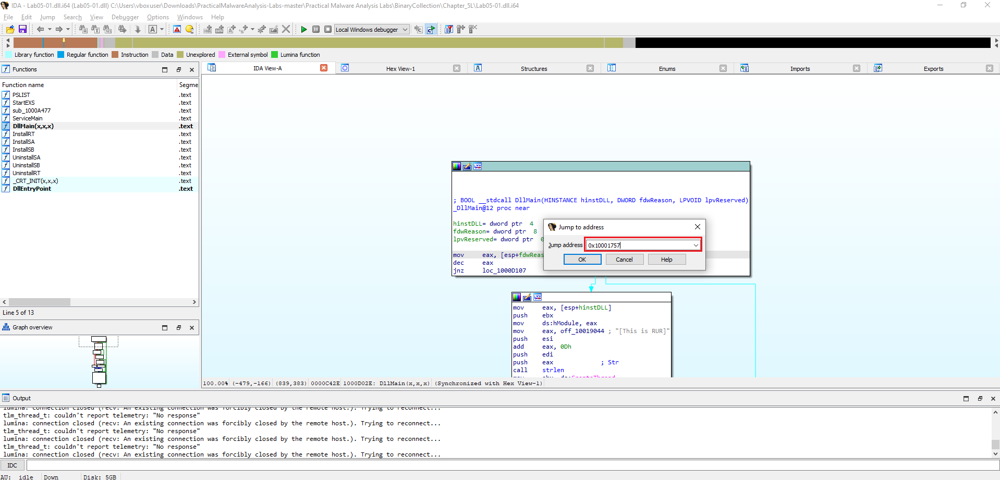
*Figure 4.1*
To answer this, I navigated directly to the address **`0x10001757`** in IDA Pro by pressing **`G`** and entering the value.  
This took me straight to the instruction that calls **`ds:gethostbyname`**.

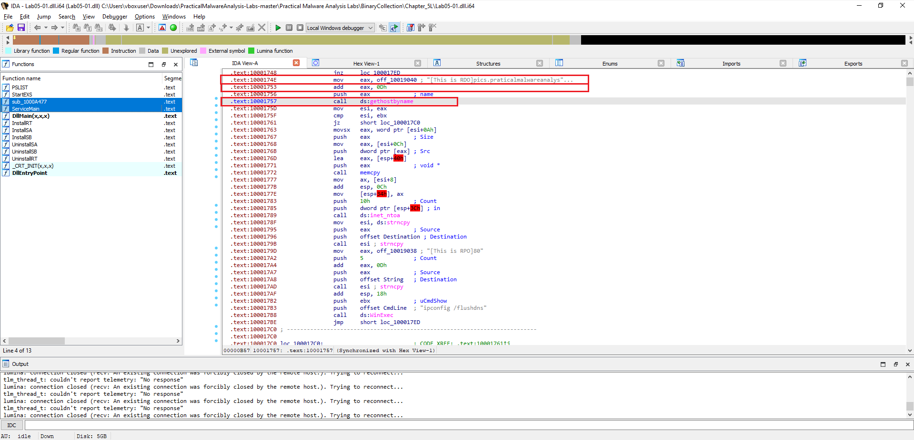
*Figure 4.2*

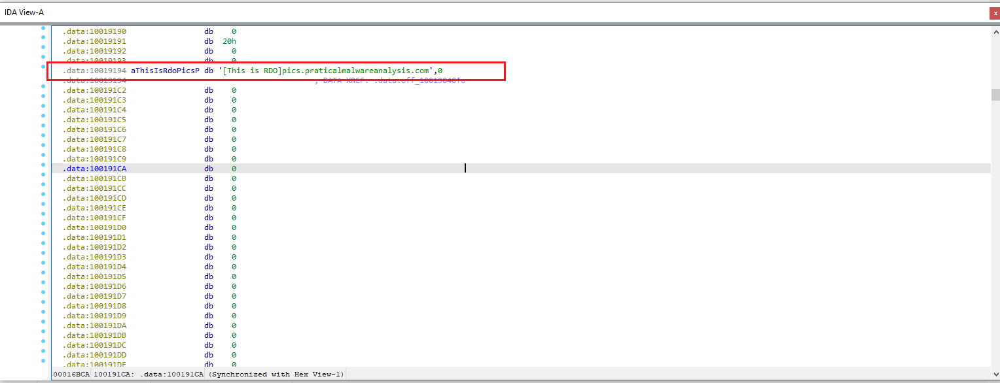
*Figure 4.3*


From there, I traced back the function arguments. In Windows, `gethostbyname` expects a pointer to a hostname string.  
By reviewing the surrounding disassembly, I found that the argument points to the hardcoded string **`pics.praticalmalwareanalysis.com`**.

Right before the call the code adds `0x0D` (hex) to EAX. Converting `0x0D` to decimal gives `13`, so the pointer is advanced `13` bytes — exactly past the prefix `"[This is RDO]"`.

> The malware performs a DNS request for **`pics.praticalmalwareanalysis.com`**.

---

### 📍 Question 5: Local Variables  

> **How many local variables has IDA Pro recognized for the subroutine at `0x10001656`?**  
{: .prompt-tip }

By jumping to **`0x10001656`** in IDA Pro (press **G** and enter the address), we can view the subroutine stack frame.  

IDA identifies **23 local variables** for this function. These are shown with negative stack offsets (e.g., `var_675`, `var_640`, etc.).

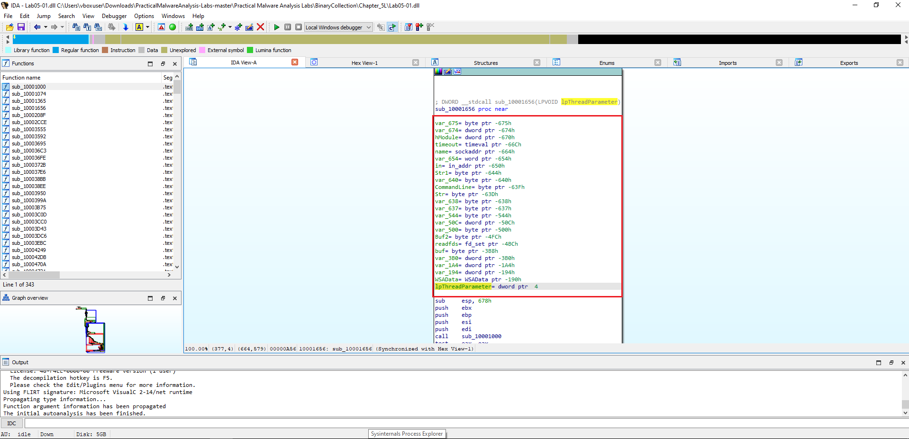 
 *Figure 5*

> IDA Pro recognized **23 local variables** for `sub_10001656`.  

---

### 📍 Question 6: Parameters  

> **How many parameters has IDA Pro recognized for the subroutine at `0x10001656`?**  
{: .prompt-tip }

In the same subroutine (`sub_10001656`), parameters are represented by positive stack offsets. IDA identifies a single parameter here:  

- **`lpThreadParameter`** (at offset `+4`)  

> IDA Pro recognized **1 parameter** for `sub_10001656`.

---

### 📍 Question 7: Command String Location 

> **Use the Strings window to locate the string `\cmd.exe /c` in the disassembly. Where is it located?**

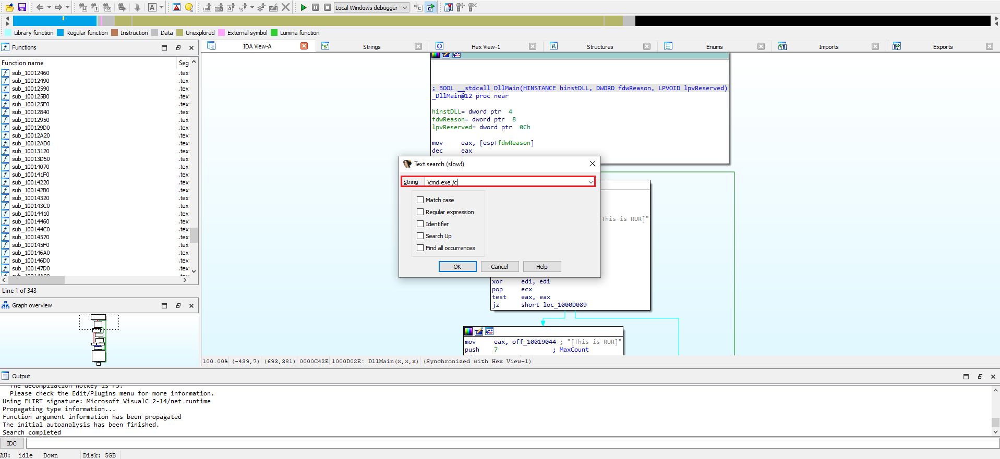
*Figure 7.1*  

I opened the **Strings** window `(Alt + T)` and searched for the exact sequence `\cmd.exe /c`. The search lands on the data entry at:

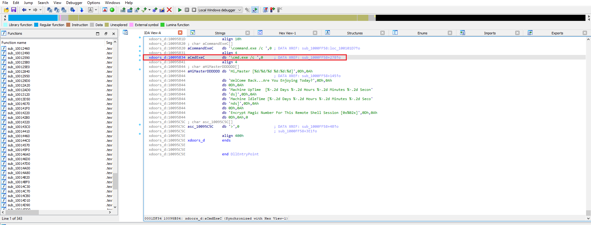
*Figure 7.2*  
> The string `\cmd.exe /c` is located at `0x10095B34`.


### 📍 Question 8: Code referencing `\cmd.exe /c`

> **What is happening in the area of code that references \cmd.exe /c?**
{: .prompt-tip }

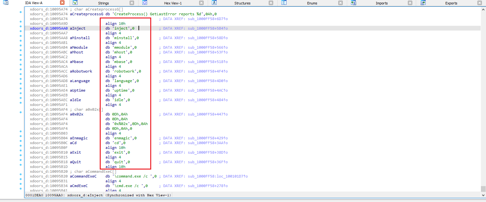
*Figure 8.1*  
the code is using the string `cmd.exe /c` to **execute shell** commands on the infected machine.

This functionality effectively creates a **remote shell**, allowing an attacker to run commands on the victim's computer.

- **How It Works**

The command cmd.exe is the Windows Command Prompt. The `/c` switch is an argument that tells `cmd.exe` to execute the command that follows it and then immediately terminate.

In the context of this malware, the program uses `cmd.exe /c` as a prefix to run other commands it receives. For example, if an attacker sends the command `dir`, the malware would construct and execute the full command `cmd.exe /c dir`. This provides a powerful and flexible way for an attacker to control the compromised system. The other strings visible in the screenshots, such as `inject`, `install`, `cd`, and `exit`, are likely commands for this `remote shell`.


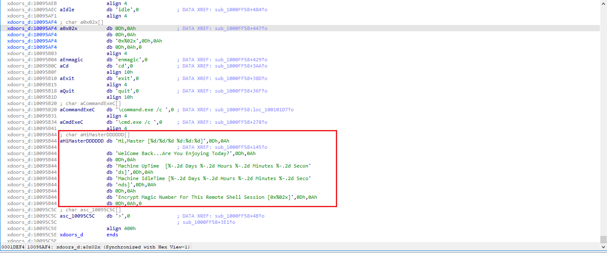
*Figure 8.2*  

we see several interesting strings that clearly indicate `remote access` and `control capabilities`:

- `aHiMasterDDDDDD`: This string, `Hi, Master [%d/%d %d:%d:%d]\n`, strongly suggests a communication or logging message intended for the attacker (the `Master`). It looks like a greeting that includes a timestamp, which is typical for remote access tools to inform the operator about connection details.

- `Welcome Back...Are You Enjoying Today?`: This is a very informal and personal message, further reinforcing the idea of an interactive session with a human operator.

- `Machine Uptime [%-2d Days %-2d Hours %-2d Minutes %-2d Secon`: This string indicates that the malware is capable of gathering system information, specifically the machine's uptime, and reporting it. This is a common feature in remote administration tools and backdoors.

- `Machine IdleTime [%-2d Days %-2d Hours %-2d Minutes %-2d Seco`: Similar to uptime, this string suggests the malware can report on how long the machine has been idle, which could be useful for an attacker to know when a user is likely not actively using the system.

- `Encrypt Magic Number For This Remote Shell Session [0x002x]\n`: This is a critical piece of information. It explicitly mentions `Remote Shell Session` and `Encrypt Magic Number,` indicating that the communication with the attacker's shell is likely encrypted and uses a specific identifier (magic number).

---


### 📍 Question 9: Global variable (dword_1008E5C4)

> **In the same area, at `0x100101C8`, it looks like dword_1008E5C4 is a global variable that helps decide which path to take. How does the malware set `dword_1008E5C4`? (Hint: Use `dword_1008E5C4`’s cross-references.)**
{: .prompt-tip }

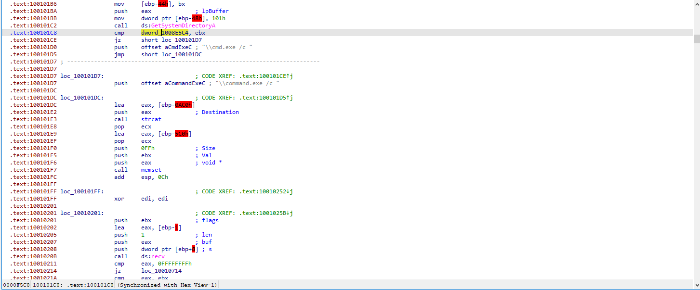
*Figure 9.1* 
To understand how the malware decides which execution path to follow, we start by navigating to the referenced address `0x100101C8` in IDA. At this location, we observe a comparison that depends on the value of the global variable `dword_1008E5C4`, indicating that it plays a key role in controlling program flow.

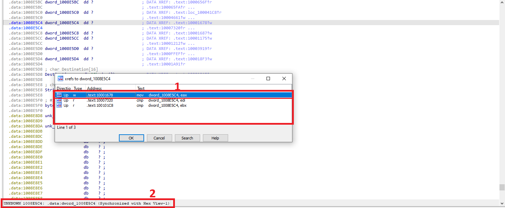
*Figure 9.2*  
To understand how `dword_1008E5C4` is set, we examine its cross-references. One of these references leads to a location where a <b>mov instruction writes a value directly</b> into `dword_1008E5C4`.

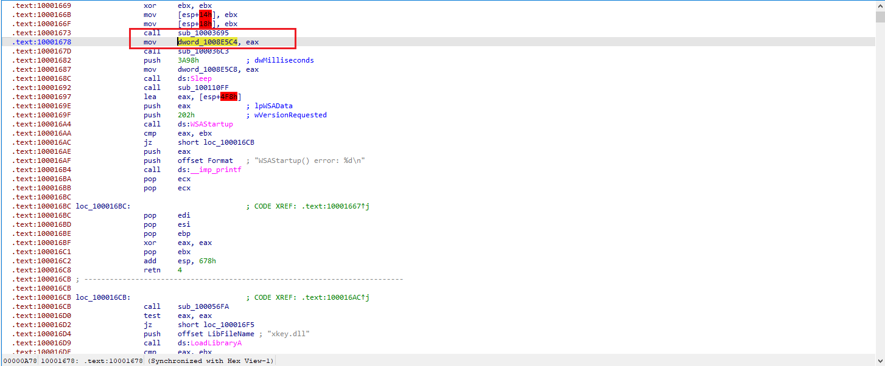
*Figure 9.3*  
Further analysis shows that the value written to `dword_1008E5C4` is the return value of the function `sub_10003695`.

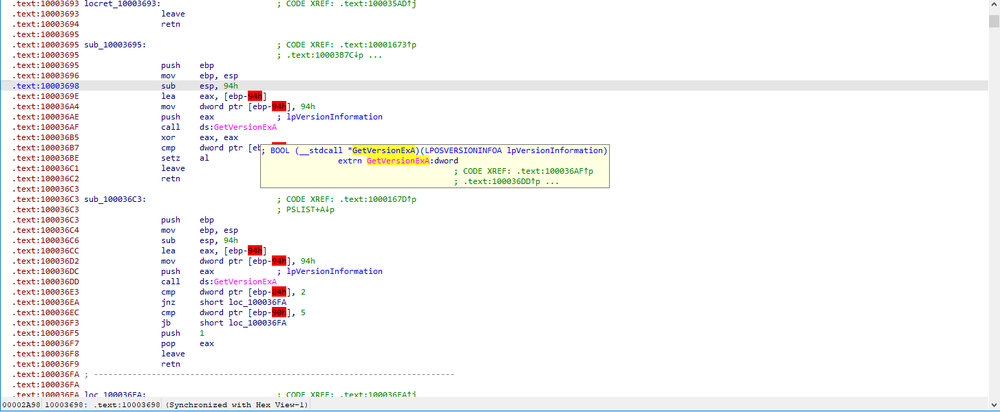
*Figure 9.4* 
In the function `sub_10003695` checks a platform-related, the program first prepares a structure containing operating system version information `lpOSVERSIONINFOA` and calls `GetVersionExA` to populate it.

After the call, the program compares a specific field in this structure with the value `2`. If the field equals `2`, the function returns `1`; otherwise, it returns `0`.

The return value is then stored directly into the global variable `dword_1008E5C4`, which is later checked at address `0x100101C8` to determine the execution path. This allows the malware to select the appropriate behavior based on the operating system.

As a result, the malware alters its behavior depending on whether it is running on a `Windows NT–based platform`.

---

### 📍 Question 10: robotwork

> **A few hundred lines into the subroutine at `0x1000FF58`, a series of comparisons use memcmp to compare strings. What happens if the string comparison to robotwork is successful (when memcmp returns `0`)?**
{: .prompt-tip }

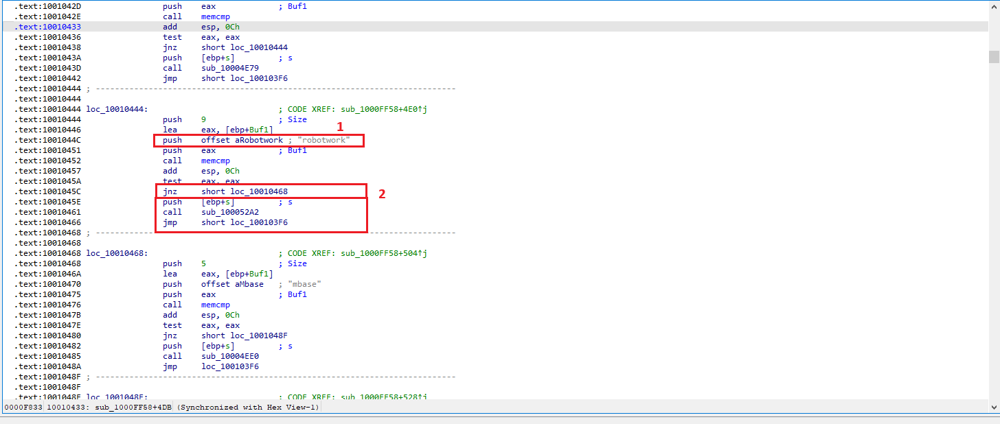
*Figure 10.1* 

the comparison against the string `"robotwork"` can be observed. This comparison is performed using `memcmp`, and the result is followed by a `jnz` (Jump if Not Zero) instruction.

Since memcmp returns `0` when the strings are equal, a successful comparison sets the Zero Flag (ZF = 1). Because jnz only jumps when ZF = 0, the jump is not taken when the comparison to `"robotwork"` is successful. Therefore, execution continues along the fall-through path.

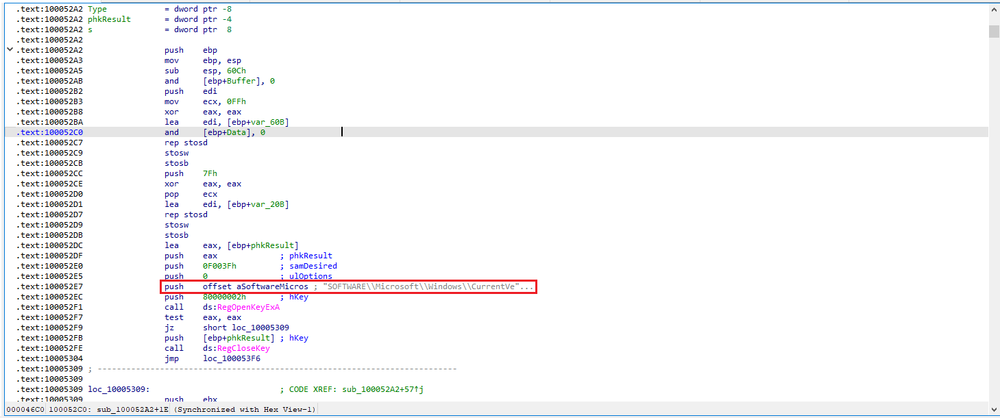
*Figure 10.2* 

Inside `sub_100052A2`, the malware accesses the registry key:
`SOFTWARE\Microsoft\Windows\CurrentVersion` registry key is used.

---
### 📍 Question 11: Export PSLIST

> **What does the export PSLIST do?**
{: .prompt-tip }

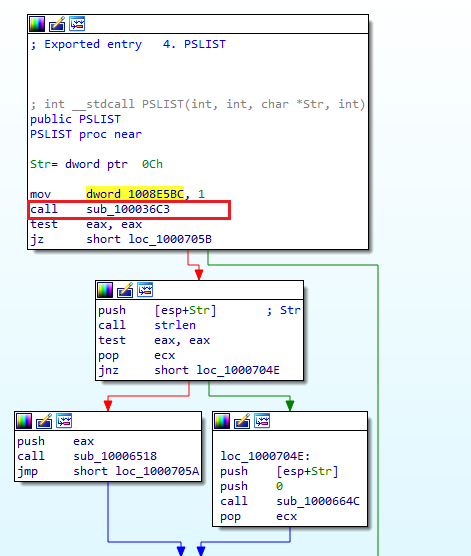
*Figure 11.1* 

The export `PSLIST` can be identified. Following this function and switching to IDA Graph View (SPACE) reveals that execution branches into two possible paths, depending on the return value of the subroutine `sub_100036C3`.

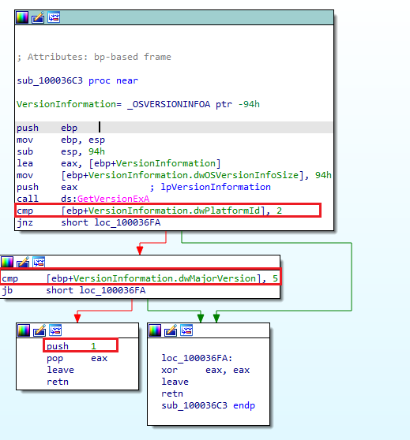
*Figure 11.2* 

Analysis of `sub_100036C3` shows that it performs operating system version checks using the `OSVERSIONINFOEXW` structure. Specifically, the function:

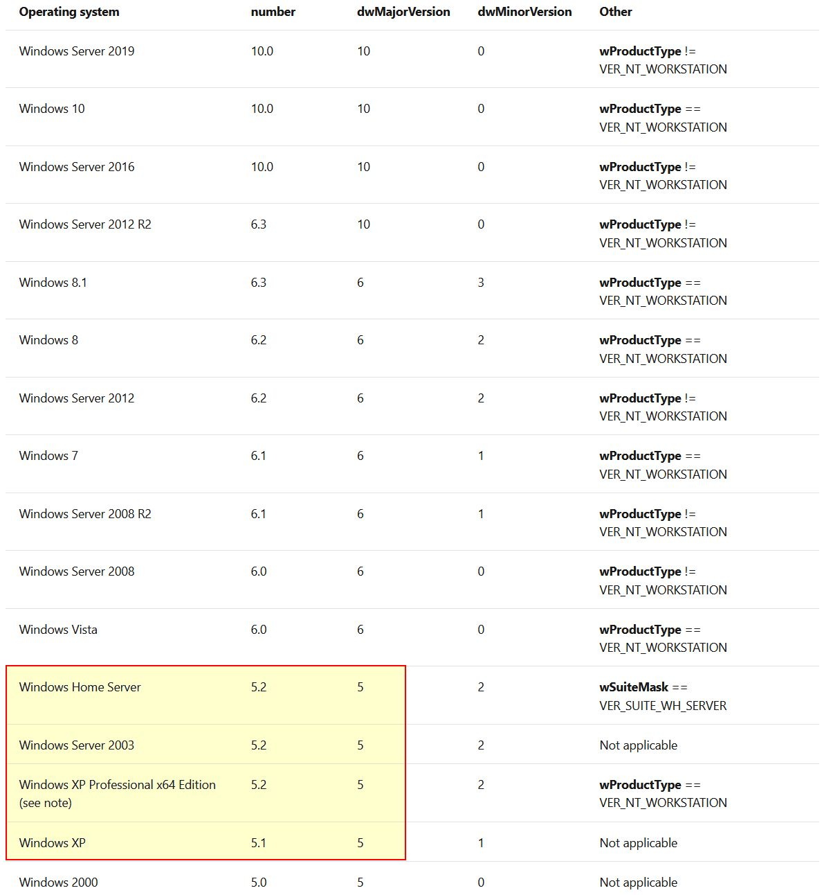
*Figure 11.3*  

  - Verifies that the platform is Windows NT-based (VER_PLATFORM_WIN32_NT)
  - Checks that the major version equals 5, corresponding to Windows 2000 or Windows XP

> In the end, it pushes the value 1 into the stack and leaves in order to continue the rest of the execution.

--- 
### 📍 Question 12: Rename API functions.

> **Use the graph mode to graph the cross-references from `sub_10004E79`. Which API functions could be called by entering this function? Based on the API functions alone, what could you rename this function?**
{: .prompt-tip }

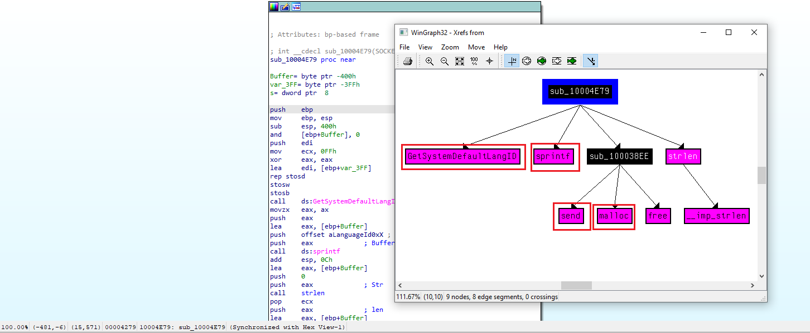
*Figure 12.1* 

By using `G` to jump to the address of interest (in this case `sub_10004E79`), and then selecting
`View` → `Graphs` → `XRefs From`, we can observe several Windows API calls referenced within this function.

From the presence of APIs related to memory allocation, string formatting, language identification, and network communication, we can infer that this function is responsible for retrieving the system default language identifier and sending it over a network socket.
- `send`
- `malloc`
- `sprintf`
- `GetSystemDefaultLangID`

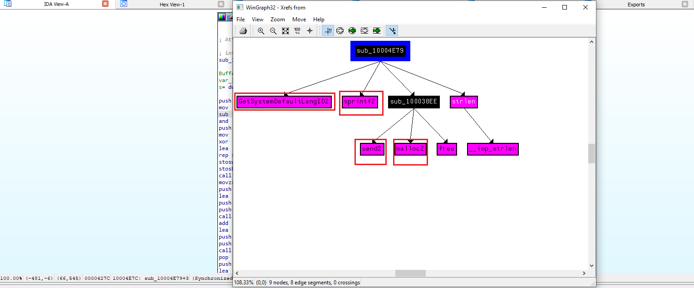
*Figure 12.2*  

During analysis, the API calls were manually renamed in IDA by pressing `N` and appending the suffix `2` to distinguish them from original imports. Examples include:

- `send2`
- `malloc2`
- `sprintf2`
- `GetSystemDefaultLangID2`

---
### 📍 Question 13: API functions DllMain call

> **How many Windows API functions does DllMain call directly? How many at a depth of 2?**
{: .prompt-tip }

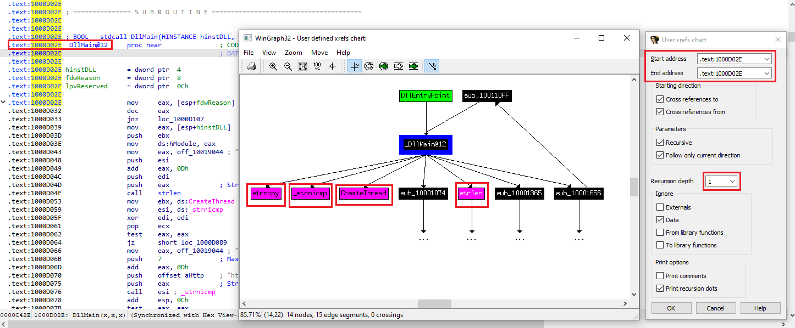
*Figure 13.1* 

we can see the functiones directly called by DLLMain, at depth `1`. This graph was made with the User Xrefs Chart (`View`-> `Graph`-> `Uxer Xrefs Chart`) at a depth of `1`.

At depth 1, we can find 4:
 Windows APIs `strncpy`, `_ strnicmp`, `chreateThread`, `strlen`.

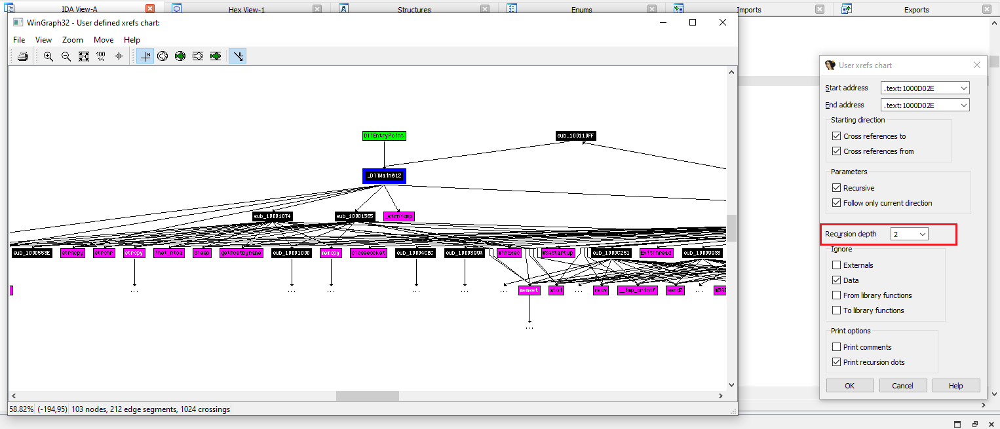
*Figure 13.2*  

 When the recursion depth is increased to `2`, the graph expands significantly. At this depth, DllMain indirectly reaches `33` Windows API function calls, including duplicates.

This demonstrates that while DllMain appears relatively small at first glance, it quickly fans out into a much larger execution tree.

---
### 📍 Question 14: Sleeping code

> **At `0x10001358`, there is a call to Sleep (an API function that takes one parameter containing the number of milliseconds to sleep). Looking backward through the code, how long will the program sleep if this code executes?**
{: .prompt-tip }

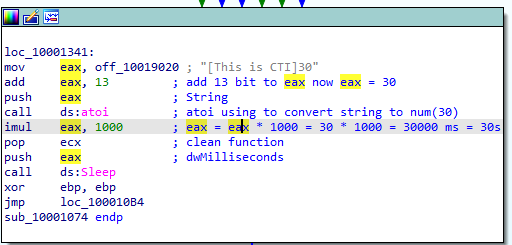
*Figure 14*  

The code loads a pointer to a string and adds `13` bytes to skip the initial part of the string, positioning `EAX` at a numeric substring (e.g., "`30`").


1- Load delay value from memory

```nasm
mov eax, off_10019020   ; "[This is CTI]30"
add eax, 13
```
2- Convert string to integer
```nasm
push eax
call ds:atoi
```
The atoi API converts the extracted ASCII string into an integer.
Example: "30" → 30

3- Convert seconds to milliseconds
```nasm
imul eax, 1000
```
The value is multiplied by 1000, converting seconds into milliseconds.
30 × 1000 = 30000 ms (30 seconds)

4- Sleep execution
```nasm
push eax
call ds:Sleep
```
The malware pauses execution for the calculated duration using the Windows Sleep API.

5- Continue execution
```nasm
xor ebp, ebp
jmp loc_100010B4
```
After sleeping, execution continues normally.


---
### 📍 Question 15: Socket parameters I

> **At `0x10001701` is a call to socket. What are the three parameters?**
{: .prompt-tip }

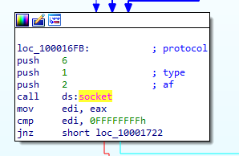
*Figure 15*  

The three parameters that are used to call the socket function are `6`, `1`, and `2`, labeled as `protocol`, `type` and `af`.

---
### 📍 Question 16: Socket  II

> **Using the MSDN page for socket and the named symbolic constants functionality in IDA Pro, can you make the parameters more meaningful? What are the parameters after you apply changes?**
{: .prompt-tip }

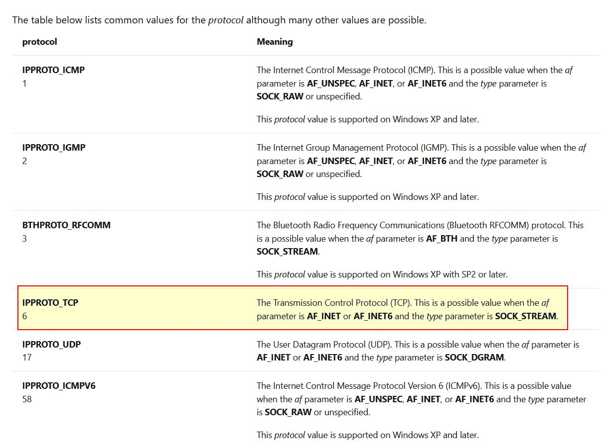
*Figure 16.1* 
By looking into the MSDN Socket Function we can find what these numbers correlate to.

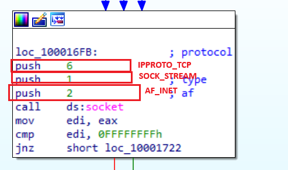
*Figure 16.2*  

According to the Microsoft documentation for socket, the values used correspond to `AF_INET` (2), `SOCK_STREAM` (1), and `IPPROTO_TCP` (6), indicating that the malware creates an IPv4 TCP socket.

---
### 📍 Question 17: opcode 0xED

> **Search for usage of the in instruction (opcode 0xED). This instruction is used with a magic string VMXh to perform VMware detection. Is that in use in this malware? Using the cross-references to the function that executes the in instruction, is there further evidence of VMware detection?**
{: .prompt-tip }

using https://www.aldeid.com/wiki/VMXh-Magic-Value

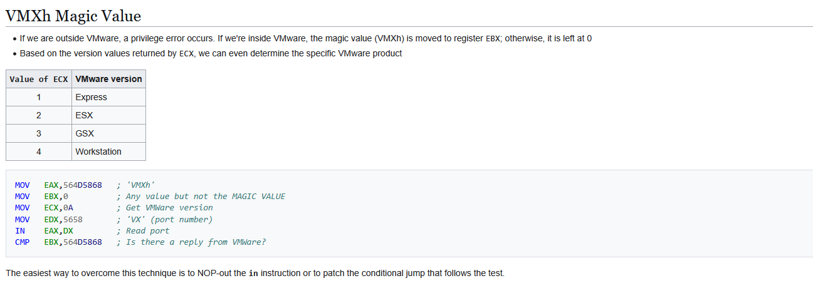
*Figure 17.1*  

The in instruction `(opcode 0xED)` is commonly used by malware as part of a VMware detection technique, where the magic value `"VMXh"` is queried to determine whether the program is running inside a virtualized environment.

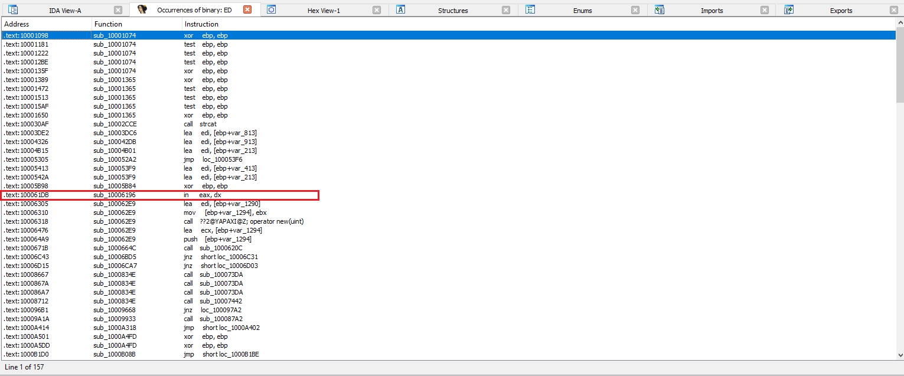
*Figure 17.2*  

By searching for the byte sequence `ED` using `ALT+B` in IDA, only one occurrence of the in instruction is found within lab.

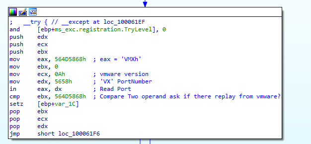
*Figure 17.3* 

Upon analyzing the function containing this instruction, the code explicitly checks for the magic value `VMXh`, confirming that the malware implements a known anti-VM technique targeting VMware.

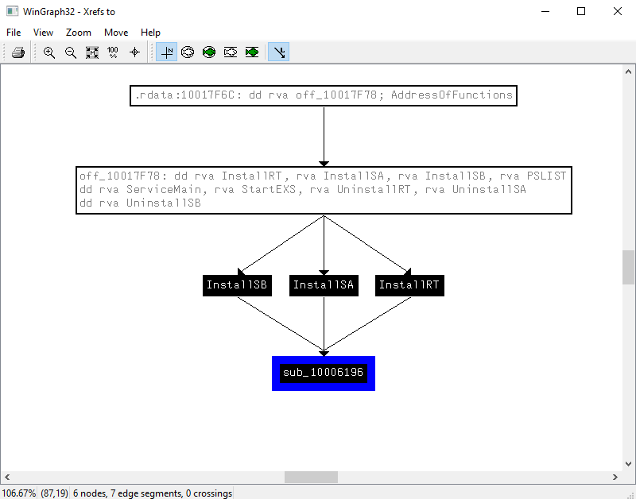
*Figure 17.4*  

The cross-reference graph shows that all installation routines (`InstallRT`, `InstallSA`, and `InstallSB`) converge on a single function (`sub_10006196`) that implements VMware detection logic. 

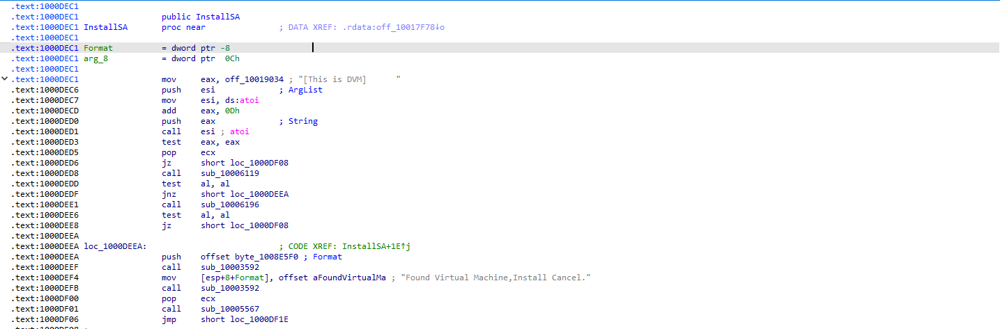
*Figure 17.5* 

This design ensures that every installation path performs an environment check before proceeding. If a VMware environment is detected, execution is redirected away from the installation logic, effectively aborting installation regardless of the chosen installation mode. This strongly indicates that VMware detection is used as an intentional anti-analysis and evasion mechanism

---
### 📍 Question 18: 0x1001D988 behavior

> **Jump your cursor to 0x1001D988. What do you find?**
{: .prompt-tip }

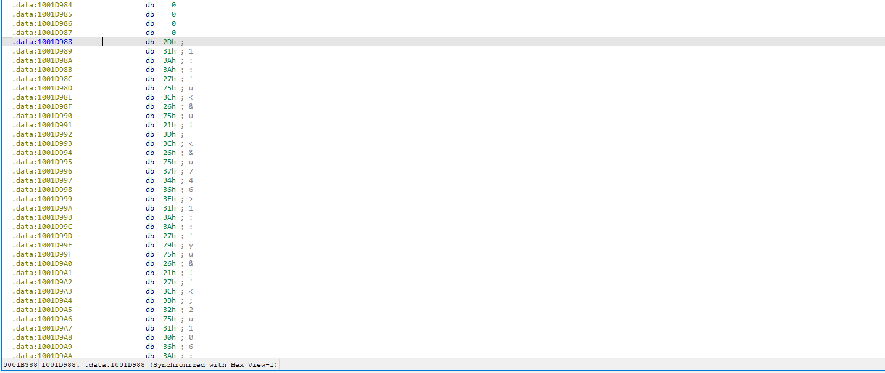
*Figure 18* 
strings 

---
### 📍 Question 19: IDA Pro Python script

> **If you have the IDA Python plug-in installed (included with the commercial version of IDA Pro), run Lab05-01.py, an IDA Pro Python script provided with the malware for this book. (Make sure the cursor is at 0x1001D988.) What happens after you run the script?**
{: .prompt-tip }


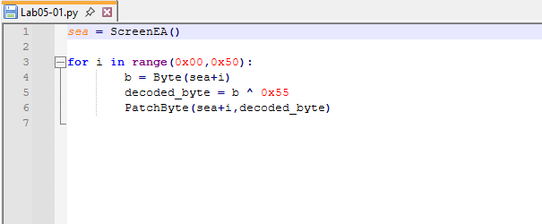
*Figure 19* 

The provided `Lab05-01.py` script is an `XOR` decoder designed to deobfuscate encoded data within the malware.
The script applies an `XOR` operation using the key `0x55`, as specified directly in the Python code


---
### 📍 Question 20: data decode

> **With the cursor in the same location, how do you turn this data into a single ASCII string?**
{: .prompt-tip }

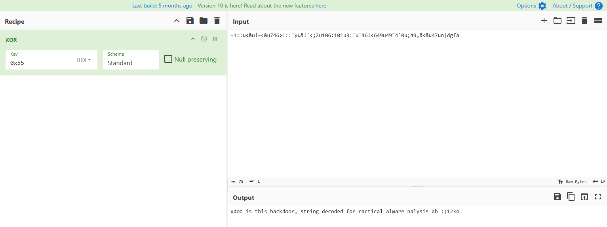
*Figure 20* 

Once converted, the decoded data is displayed as a single ASCII string 
```
xdoo is this backdoor, string decoded for ractical alware nalysis ab :)1234
```

---
### 📍 Question 21: text editor

> **Open the script with a text editor. How does it work?**
{: .prompt-tip }


The script declares a variable using `ScreenEA()`, which retrieves the current effective address in IDA where the encoded string begins.

It then iterates from `0x00` to `0x50` (80 bytes in decimal, which corresponds to the length of the encoded string). During each iteration, the script decodes the data by applying an XOR operation with the key `0x55`.

The `PatchByte()` function is used to overwrite each encoded byte in memory with its decoded value, effectively modifying the data in place.

After the script completes execution, the decoded string is revealed as:
```
rxdoor is this backdoor, string decoded for Practical Malware Analysis Lab :)1234
```

