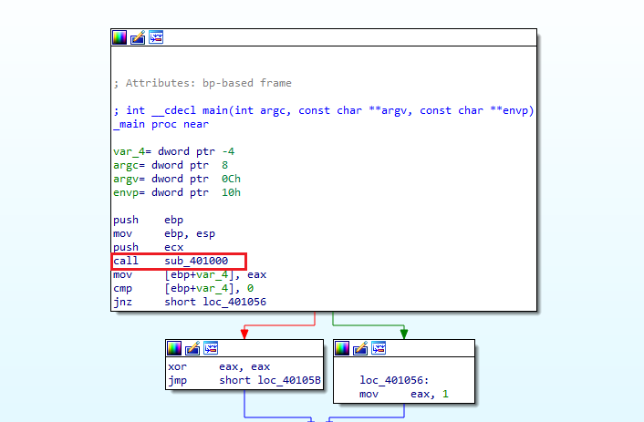
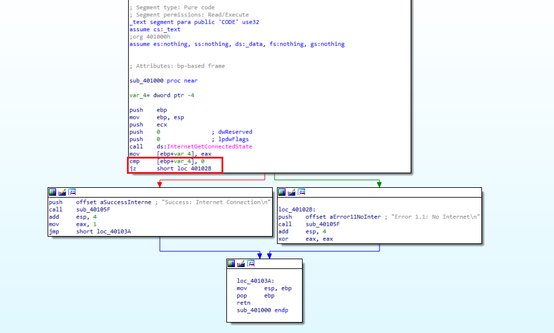

## Lab 6-1

### 📝 Summary

The Chapter 6 labs teach you to identify C code constructs in assembly by analyzing a multi-stage malware sample. Each lab reveals one construct (if → loop → switch → complex), building toward full program understanding.

**Key Learning Objectives:**
- Recognize `if/else` via conditional jumps (CMP/JZ/JNZ)
- Spot loops via backward JMPs and counters  
- Identify switch statements via jump tables
- Trace imports using IDA Pro cross-references (XREFs)

---

### 🛠️ Toolkit

| **Tool** | **Type** | **Purpose** | **Why Essential** |
|----------|----------|-------------|-------------------|
| **IDA Pro / Ghidra** | Static | Disassemble/decompile + graphs | Maps control flow, reveals constructs |
| **PEview** | Static | PE headers/imports | Quick file inspection |
| **Detect It Easy** | Static | Packer detection | Confirms unpacked sample |

---

### 📍 Question 1: Code Construct

> **What is the major code construct found in the only subroutine called by main?**
{: .prompt-tip }

The `main` function calls a single subroutine [Figure 1.1].

*Figure 1.1*

Now, let’s look into the subroutine, in Figure 1.2.

**Analysis:** Dive into the subroutine [Figure 1.2]. Notice `InternetGetConnectedState` Windows API function → `Compare` instruction → `jump` instruction.

*Figure 1.2*

We can see that there is a call being made to the function `InternetGetConnectedState`. The program checks for an internet connection.
Moving into this routine we see that there is a compare statement before a JZ jump statement, and by using the graph view we can verify that this is indicative **if-statement**

---

### 📍 Question 2: imports location

> **What is the subroutine located at 0x40105F?**
{: .prompt-tip }

*Figure 2*

To find out where an imported function is used, you can check its cross-references (often shortened to "xrefs"). This is a powerful feature in IDA Pro that shows every location in the code that refers to a selected function, string, or address.

1.  Navigate to the Function: Go to the Imports window and click on the gethostbyname function, just as in the previous question.
2.  Find Cross-References: With gethostbyname selected, press the X key on your keyboard. This opens the "Cross References" window.
3.  Count the Calls: The window will list every   

---
